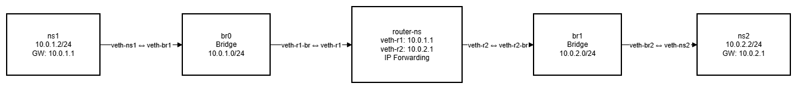

# Linux Network Namespace Simulation

## Objective

This project demonstrates how to simulate isolated network environments using Linux network namespaces, bridges, and routing. Two separate networks are created and connected via a router namespace.

## Network Topology



## IP Addressing Scheme

| Namespace | Interface | IP Address  | Network     | Role    |
| --------- | --------- | ----------- | ----------- | ------- |
| ns1       | veth-ns1  | 10.0.1.2/24 | 10.0.1.0/24 | Host A  |
| router-ns | veth-r1   | 10.0.1.1/24 | 10.0.1.0/24 | Gateway |
| router-ns | veth-r2   | 10.0.2.1/24 | 10.0.2.0/24 | Gateway |
| ns2       | veth-ns2  | 10.0.2.2/24 | 10.0.2.0/24 | Host B  |

## Implementation Steps

1. Created two bridges: `br0`, `br1`
2. Created namespaces: `ns1`, `ns2`, `router-ns`
3. Connected using veth pairs
4. Assigned IP addresses
5. Enabled IP forwarding in router
6. Configured routing between networks

## Routing Configuration

- ns1 default route - `10.0.1.1`
- ns2 default route - `10.0.2.1`
- router-ns has `ip_forward=1` enabled

## Scripts

### Setup Script

Run:

```bash
./setup.sh
```

This will:

- Create bridges (`br0`, `br1`)
- Create namespaces (`ns1`, `ns2`, `router-ns`)
- Configure veth pairs
- Assign IP addresses
- Enable routing

### Cleanup Script

```bash
./cleanup.sh
```

Removes:

- Namespaces
- Bridges
- All network interfaces

## Testing

### 1. Basic Connectivity

```bash
ip netns exec ns1 ping 10.0.1.1
```

Expected:

```
64 bytes from 10.0.1.1 ...
```

### 2. Router to ns2

```bash
ip netns exec router-ns ping 10.0.2.2
```

Expected:

```
64 bytes from 10.0.2.2 ...
```

### 3. Cross-Network (FINAL TEST)

```bash
ip netns exec ns1 ping 10.0.2.2
```

Expected Output:

```
64 bytes from 10.0.2.2: icmp_seq=1 ttl=63 time=...
```

## Concepts Used

- Linux Network Namespaces
- Virtual Ethernet (veth)
- Linux Bridges
- IP Routing
- IP Forwarding

## Notes

- Requires root privileges
- May not work in WSL due to kernel limitations
- Works in real Linux / VM / privileged container

## Conclusion

This project successfully demonstrates network isolation and inter-network routing using Linux namespaces. Full connectivity between two isolated networks was achieved via a router namespace.
